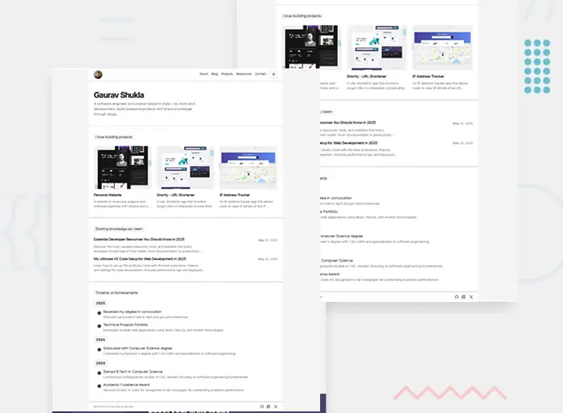

# Personal Website

This is my personal website to showcase my projects, write technical blogs using MDX, and share development resources. It's built with a modern frontend stack and designed with performance, accessibility, and scalability in mind.

## Table of contents

- [Overview](#overview)

  - [The challenge](#the-challenge)
  - [Screenshot](#screenshot)
  - [Links](#links)

- [My process](#my-process)

  - [Built with](#built-with)
  - [What I learned](#what-i-learned)
  - [Continued development](#continued-development)
  - [Useful resources](#useful-resources)

- [Author](#author)
- [Acknowledgments](#acknowledgments)

## Overview

### The challenge

Users should be able to:

- Explore a responsive personal site with light/dark mode
- Read technical blog posts powered by MDX
- View project case studies with live demos and source code
- Access a curated list of development resources
- Contact me via a validated, accessible form

### Screenshot

### Links

- Live Site URL: [https://gshukla.vercel.app](https://gshukla.vercel.app)
- Repository URL: [https://github.com/heygauravshukla/personal-website](https://github.com/heygauravshukla/personal-website)

## My process

### Built with

- Semantic JSX markup
- Mobile-first responsive design
- [Next.js 15 (App Router)](https://nextjs.org/)
- [TypeScript](https://www.typescriptlang.org/)
- [Tailwind CSS](https://tailwindcss.com/)
- [shadcn/ui](https://ui.shadcn.com/)
- [Motion](https://motion.dev)
- [MDX](https://mdxjs.com/)
- [react-hook-form](https://react-hook-form.com/)
- [Zod](https://zod.dev/)
- [EmailJS](https://www.emailjs.com/)
- [Sonner](https://sonner.emilkowal.ski/)
- [pnpm](https://pnpm.io/)

### What I learned

- How to set up MDX in a Next.js project for blog content
- Implementing smooth page transitions using the `next-view-transitions` package
- Adding micro interactions and subtle animations using Motion library
- Creating accessible forms with real-time validation using `react-hook-form` and `Zod`
- Building reusable components with shadcn/ui and Tailwind CSS
- Structuring a scalable Next.js project using the App Router

### Continued development

- Add code syntax highlighting using Shiki or rehype-prism
- Introduce filtering/tag system for blog and project content
- Generate dynamic OG images for SEO
- Integrate full-featured analytics dashboard
- Automate RSS feed and sitemap

### Useful resources

- [Building a Portfolio with Next.js & Motion – Manu Arora](https://youtu.be/J0sT7d0r6T4?si=dGtAEwNyvUPWwP2H) – Helpful for animations and layout
- [MDX in Next.js – Colby Fayock](https://youtu.be/MsSUAOkepCw?si=DX6Fboi9r02nfqFx) – Clear walkthrough on using MDX
- [Next.js App Router Docs](https://nextjs.org/docs/app) – Essential reference for the new routing system
- [shadcn/ui](https://ui.shadcn.com/) – Component library used for UI patterns
- [Squoosh](https://squoosh.app) – Image optimization tool
- [RedKetchup](https://redketchup.io/favicon-generator) - Favicon Generator

## Author

- Website – [gshukla.vercel.app](https://gshukla.vercel.app)
- GitHub – [@heygauravshukla](https://github.com/heygauravshukla)
- Twitter – [@heygauravshukla](https://twitter.com/heygauravshukla)

## Acknowledgments

Huge thanks to the content creators who inspired this build — especially [Manu Arora](https://www.youtube.com/@manuarora) and [Colby Fayock](https://www.youtube.com/@colbyfayock).
